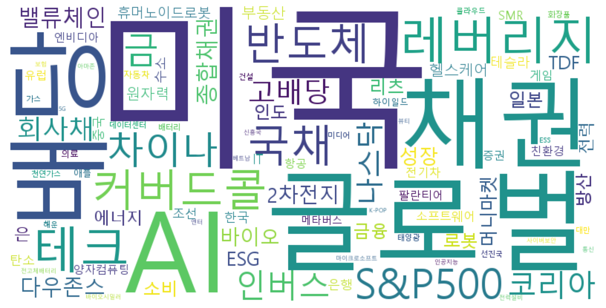

# KrETFCrawler

한국 ETF(상장지수펀드) 시세를 수집·저장하는 프로젝트입니다.



## `docs/` 디렉터리

수집된 ETF 데이터가 저장되는 루트 폴더입니다.

```
docs/
├── label_data/     # 종목 메타데이터
├── etf_data/       # 종목별 일별 시세 (CSV)
└── sqlite/         # SQLite DB (label + 시세 샤드)
```

### `docs/label_data/`

종목 목록 및 부가 정보를 담습니다.

| 파일 | 설명 |
| --- | --- |
| `etf_list.csv` | 전체 ETF 종목 코드·이름 목록 (`Code`, `Name` 컬럼) |
| `etf_keyword_cloud.png` | ETF 이름 키워드 워드클라우드 이미지 |

- `etf_list.csv`는 `script/etf_list.py`로 네이버 금융 API에서 수집합니다.
- 워드클라우드는 `script/etf_keyword.py`로 생성합니다.

### `docs/etf_data/`

종목별 일별 시세 CSV 파일이 저장됩니다.

| 항목 | 내용 |
| --- | --- |
| 파일명 | `{종목코드}.csv` (예: `069500.csv`, `0018C0.csv`) |
| 컬럼 | `날짜`, `종가`, `전일비`, `시가`, `고가`, `저가`, `거래량` |
| 정렬 | 최신 날짜가 위쪽 |
| 수집 | `script/collect.py`, `script/update_etfs.py` |

각 CSV는 해당 종목의 전체 일별 시세 이력을 담으며, 업데이트 시 기존 날짜와 중복되면 수집을 중단합니다.

### `docs/sqlite/`

CSV 데이터를 SQLite DB로 변환해 저장합니다. (`script/sqlite.py` 실행 시 생성·갱신)

#### Label DB

| 파일 | 테이블 | 설명 |
| --- | --- | --- |
| `kr_etf_lable.db` | `etf_list` | `etf_list.csv`와 동일한 종목 코드·이름 |

#### ETF 시세 DB (샤드)

종목 코드를 `100,000`으로 나눈 몫에 따라 DB 파일이 분리됩니다.

| 몫 | DB 파일 | 코드 범위 예시 |
| --- | --- | --- |
| 0 | `kr_etf_sqlite_00.db` | `069500`, `0018C0` |
| 1 | `kr_etf_sqlite_01.db` | `100000` ~ `199999` |
| 2 | `kr_etf_sqlite_02.db` | `200000` ~ `299999` |
| 3 | `kr_etf_sqlite_03.db` | `300000` ~ `399999` |
| 4 | `kr_etf_sqlite_04.db` | `400000` ~ `499999` |

각 DB 안에는 종목 코드명 테이블(예: `"069500"`)이 있으며, 컬럼 구성은 CSV와 동일합니다. 알파벳이 포함된 종목 코드는 앞쪽 숫자 부분으로 샤드를 계산합니다.

#### File link

https://fnwinter.github.io/KrETFCrawler/label_data/etf_list.csv
https://fnwinter.github.io/KrETFCrawler/etf_data/0000D0.csv
https://fnwinter.github.io/KrETFCrawler/sqlite/kr_etf_label.db
https://fnwinter.github.io/KrETFCrawler/sqlite/kr_etf_sqlite_00.db
